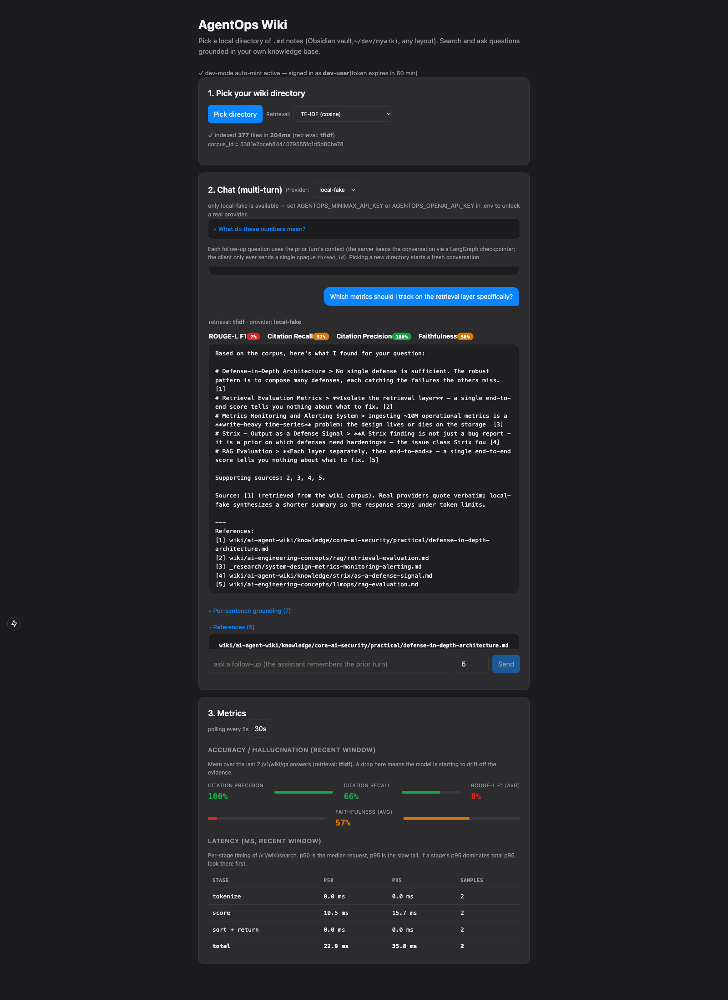

# AgentOps Workbench

> Lives at `apps/agentops-workbench/` inside `sh-ai-x/WikiGrounded`.
> All commands below assume you are in this directory.

> **Pivot (2026-09-13):** the portfolio narrative is retargeted from
> generic customer-support ticketing to **developer-tooling / open-source
> maintainer automation** — the domain the author can actually judge and
> defend. The evidence-retrieval layer generalizes from one hardcoded
> document corpus into a general **Adapter pattern**
> (`EvidenceSourceAdapter`, [ADR-0007](docs/adr/0007-evidence-source-adapter-pattern.md))
> so the same agent can point at a Wiki, security logs, GitHub Issues, or
> AI-incident data depending on deployment, plus a ticket-ledger facade
> proving the pattern also covers the original ticketing use case with
> zero new domain logic. **All five adapters are real and tested** ([PR
> #34](https://github.com/sh-ai-x/WikiGrounded/pull/34), merged, 223
> passing) but **not yet wired into `graph/**`** — everything below this
> note still describes the original ticketing flow end-to-end, which is
> what actually runs today.
>
> The product scope has since narrowed to one flagship flow —
> `agentops-oss-helper <github-repo-url>` — wired with just the **Wiki**
> half of the Adapter pattern. The original two-source design (Wiki +
> GitHub Issues) was reduced to docs-only on 2026-09-15 because anonymous
> GitHub API access to `/search/issues` is rate-limited to 60 req/h per
> IP and refuses with `422` on popular or large repos — making the demo
> fail on the very targets it was meant to demonstrate. See
> [ADR-0009](docs/adr/0009-oss-helper-docs-only-scope.md) for the full
> decision record. **Token-free setup** remains a hard requirement for
> the flagship demo.
>
> The remaining phase 8 scope (Fly.io deployment, backend/frontend
> split verifiable without Streamlit, the five operational fixes
> listed below) is unchanged — see the linked proposal and ADRs for
> detail.

A Next.js 15 web chat over a local **LLM Wiki directory** (Obsidian vault) —
multi-turn retrieval-augmented conversation with per-turn groundedness metrics
(Faithfulness, Citation Precision/Recall, ROUGE-L F1), Obsidian deep-links back
to source notes, and a live per-stage latency dashboard. Built on LangGraph
with a Wiki [EvidenceSourceAdapter](docs/adr/0007-evidence-source-adapter-pattern.md);
the flagship flow is `agentops-oss-helper <github-repo-url>`, narrowed to
the Wiki half per [ADR-0009](docs/adr/0009-oss-helper-docs-only-scope.md).

## Quickstart

```bash
# Requires uv (https://docs.astral.sh/uv/)
uv sync --extra dev
cp .env.example .env  # edit AGENTOPS_MINIMAX_API_KEY for a live provider
uv run pytest -q
uv run ruff check .

# Terminal 1 -- the FastAPI backend (serves /v1/wiki/*).
# AGENTOPS_ALLOW_DEV_TOKEN=1 lets the web UI auto-mint a dev JWT.
AGENTOPS_PROVIDER=minimax AGENTOPS_ALLOW_DEV_TOKEN=1 \
  uv run uvicorn agentops_workbench.api.server:app --port 8000

# Terminal 2 -- the Next.js chat UI, then open http://localhost:3000/
cd web && npm install && npx next dev --port 3000
```

Details of the chat surface itself are in
[Web UI (wiki chat)](#web-ui-wiki-chat) below.

## Live provider setup

`provider=local-fake` is the dev default. For live experiments, set `provider=minimax` (or `anthropic`). Get a key from your MiniMax dashboard and put it into your local `.env`
(this file is gitignored):

```
AGENTOPS_PROVIDER=minimax
AGENTOPS_MINIMAX_API_KEY=<your-key-here>
AGENTOPS_MINIMAX_BASE_URL=https://api.minimax.io/v1   # or .chat, per your account
```

CI uses `provider=local-fake` and needs no key.

**Never commit a populated `.env`.**

## Screenshots



The Next.js app at `web/` is the operator surface. Step 1 is the
**Pick your wiki directory** card — the browser's directory picker
reads the `.md` notes client-side and POSTs them to
`/v1/wiki/index-files`; the dev-mode badge shows the JWT was
auto-minted, so there is no token to paste. The **Metrics** card is
live: Citation Precision, Citation Recall, ROUGE-L F1 and Faithfulness
bars over the trailing call window, plus a per-stage latency table
(`tokenize / score / sort+return / total`, p50 and p95). The chat
panel appears between the two once a directory is picked.

## Metrics

Live, web-debuggable metrics for the workbench app:

```bash
curl http://127.0.0.1:8000/_debug/metrics
```

Returns (recomputed on every request):

```json
{
  "test_count": 154,
  "db_stats": {"runs": 47, "tool_calls": 0, "actions": 16},
  "screenshots": {"count": 5, "bytes_total": 928525},
  "line_diff_vs_main": {"added": 250, "removed": 5},
  "settings": {"provider": "minimax", "model": "MiniMax-M3"},
  "recent_cost_usd": 0.0,
  "caveats": {
    "cost_usd": "Local-fake always returns 0.0 (fixture is free). For minimax/openai/anthropic, cost is computed locally...",
    "tool_calls": "fixed-v1/single-agent-v1 stay at 0 by design; planner-executor-v1 persists one ToolCall row per executed step (ok for search_docs/read_document, error/unsupported_capability for get_issue)..."
  }
}
```

**Cost model**: `prompt_tokens/1M × input_per_1m + completion_tokens/1M × output_per_1m` per call, using
`src/agentops_workbench/llm/pricing.py::DEFAULT_PRICING` (default `MiniMax-M3 = $0.50/$1.50 per 1M`). Override per-deployment via:

```bash
export AGENTOPS_PRICING_JSON='{"my-fine-tune":{"input_per_1m":1.20,"output_per_1m":3.40}}'
```

**Tool calls**: `fixed-v1`'s only call is an in-process lexical retrieval — it never makes MCP tool calls, by design (see ADR-0006). `single-agent-v1`'s `TOOL <tool_name> <json_args>` directive now dispatches for real: `search_docs`/`read_document` call a real `DocumentClient` (`InMemoryDocumentClient`, reading `fixtures/docs/*.md`), fed back into the ReAct transcript for the next turn; `get_issue` has no real backend anywhere in this repo and normalises to `outcome.status="error"` with `outcome.error_kind="unsupported_capability"` rather than crashing the loop. `planner-executor-v1` does the same against its own plan/execute/synthesize structure. With `provider=local-fake` (the CI default) neither the ReAct loop nor the planner LLM ever emits a `TOOL`/plan directive, so `tool_calls` stays at 0 under CI for both `single-agent-v1` and `planner-executor-v1`; a live provider (minimax/openai/anthropic) that actually calls a tool produces non-zero `tool_calls`. (The `/_debug/metrics` endpoint's own caveat string still describes the pre-fix `single-agent-v1` stub as of this writing — tracked as a follow-up, not yet corrected in code.)

**CLI equivalent**: `uv run python scripts/print_metrics.py` prints the same numbers from the CLI.

## Architecture

One flow: the browser picks a local directory of `.md` notes, the
backend indexes it into an in-process corpus, and each chat turn
retrieves from that corpus, answers with numbered citations, and scores
the answer before it reaches the UI.

```
web/ (Next.js)  --- POST /v1/wiki/index-files --->  wiki_corpus.py
  directory picker    {path, content, mtime}[]        temp dir + WikiRagAdapter
                                                      -> corpus_id (LRU registry)

web/ chat turn  --- POST /v1/wiki/qa ----------->  graph/wiki_chat.py
  {corpus_id, query, thread_id}                     [retrieve] -> [answer]
                                                        |            |
                                                   wiki_corpus     LLMAdapter
                                                    .search        (provider-agnostic)
                                                        |
                                                   groundedness.py
                                                    Faithfulness / ROUGE-L F1 /
                                                    Citation Precision + Recall
                                                        |
                                                   wiki_metrics.py  <-- GET /v1/wiki/metrics
                                                    rolling p50/p95 + averages
```

- **LangGraph** (`langgraph==1.2.11`): `graph/wiki_chat.py` is a checkpointed retrieve → answer graph. A `MemorySaver` checkpointer keyed by `thread_id` holds the transcript server-side, so the client sends only `{corpus_id, query, thread_id}` on a follow-up turn, never the growing history. Non-serializable runtime objects (the live `LLMAdapter`, the `Tracer`) travel in `config["configurable"]`, not in state.
- **Retrieval**: `wiki_corpus.py` owns a process-local, LRU-capped registry of corpora. Each one is a `WikiRagAdapter` (`adapters/wiki_rag.py`) built over a temp dir of the uploaded notes, with a selectable lexical scorer — `retrieval="tfidf"` (default, cosine similarity over TF-IDF vectors) or `retrieval="bm25"` (Okapi BM25, k1=1.5/b=0.75, term-frequency saturation + document-length normalization); pass `retrieval` on `POST /v1/wiki/index-files` per corpus, or set `AGENTOPS_WIKI_DEFAULT_RETRIEVAL=bm25` to change the fallback. See [Retrieval algorithm](#retrieval-algorithm) below. Hits carry provenance fields (`source_path`, `evidence_span` with character offsets, `coverage`, `contributing_terms`, `mtime`). Nothing is persisted to server disk beyond the corpus lifetime.
- **Groundedness**: `groundedness.py` computes the four per-turn metrics; `wiki_metrics.py` keeps the trailing 200-call windows the dashboard reads.
- **FastAPI**: `POST /v1/wiki/index-files`, `GET /v1/wiki/search`, `POST /v1/wiki/qa`, `GET /v1/wiki/metrics`, plus `GET /v1/auth/dev-token` and `GET /v1/auth/dev-mode` for the local auto-mint path (HS256 JWT, `AGENTOPS_JWT_SECRET` in `.env`).
- **SQLAlchemy + SQLite** (Postgres in prod): `db/models.py` — the run ledger tables behind the API's persistence layer and `/_debug/metrics`.
- **Provider**: `{openai, anthropic, minimax, local-fake}` behind `LLMAdapter`; graph code never names a provider.

## Code layout

```
src/agentops_workbench/
  api/server.py              # FastAPI + JWT; /v1/wiki/*, /v1/auth/dev-token,
                             # /_debug/metrics
  wiki_corpus.py             # per-corpus_id registry (LRU) + provenance-aware
                             # search over the picked directory
  adapters/wiki_rag.py       # WikiRagAdapter -- TF-IDF+cosine or BM25 (selectable)
  graph/wiki_chat.py         # checkpointed multi-turn chat graph (MemorySaver,
                             # keyed by thread_id) + numbered citations
  graph/{fixed,single_agent,planner_executor,topology,state}.py
  groundedness.py            # Faithfulness, ROUGE-L F1, Citation Precision/Recall
  wiki_metrics.py            # trailing-window latency + groundedness recorders
  llm/{adapter,factory,local_fake,minimax,openai_compat,pricing}.py
  db/{models,session}.py     # SQLAlchemy models + session factory
  mcp/mcp_servers/{document,filesystem}/...
  observability/otel.py      # Tracer + redact
web/
  app/{page,layout,HomePageImpl,MetricsPanel}.tsx
                             # Next.js 15 chat UI (multi-turn + Faithfulness
                             # dashboard + Obsidian deep-links); see
                             # "Web UI (wiki chat)" below.
docs/
  adr/000{1,2,3,4,6,7,8}-*.md  # design decisions
  screenshots/               # README captures
```

## Tests

```bash
uv run pytest -q     # 154 tests
uv run ruff check .  # clean
```

## Web UI (wiki chat)

`web/` is a Next.js 15 single-page app for the wiki evidence
surface — multi-turn chat over the operator's picked local directory
of `.md` notes, with four academic-grounded groundedness metrics on
every turn, a Faithfulness dashboard, and Obsidian deep-links when
the picked directory is an Obsidian vault.

```bash
# In one terminal: the FastAPI backend (serves /v1/wiki/* including
# /v1/wiki/metrics the dashboard polls).
AGENTOPS_PROVIDER=minimax AGENTOPS_ALLOW_DEV_TOKEN=1 \
  uv run uvicorn agentops_workbench.api.server:app --port 8000

# In another terminal: the Next.js dev server.
cd web && npm install && npx next dev --port 3000

# Open http://localhost:3000/ -- auto-mints a dev JWT, no token paste.
# Pick a directory, then ask questions; prior turns stay visible and
# the LangGraph checkpointer on the server keeps the conversation
# thread live across HTTP calls.
```

### How Faithfulness is measured

Per **Maynez et al., 2020** ("On the Faithfulness and Factuality
in Abstractive Summarization") with the dependency-light
lexical-entailment proxy from **Goodrich et al., 2019** (no NLI
model needed):

1. The LLM's answer is split into atomic facts — one per sentence,
   after stripping inline `[N]` citation markers so a sentence like
   `"Postgres persists checkpoints [1]."` becomes the fact
   `"Postgres persists checkpoints."`.
2. Each fact tokenizes with the codebase's standard alphanumeric
   pattern (`[a-z0-9]+`).
3. The cited evidence (the union of `[N]`-resolved entries) tokenizes
   the same way.
4. **Jaccard token overlap per fact**: `|fact_tokens ∩ evidence_tokens|
   / |fact_tokens|`. A paraphrase scores 0.5-0.7, a fully-supported
   claim scores 1.0, a fabrication (different vocab) scores
   0.0-0.1.
5. Mean across the answer's facts is the **per-turn badge**; mean
   across the trailing 200-call window is the **dashboard bar**.

A score of `0.000` on the dashboard means the LLM was answering
without evidence overlap — typically because the picked vault
doesn't contain the topic of the question. Pick a vault with the
relevant content (or just ask about what's in the picked dir)
and the score will rise.

### Citation metrics

Alongside Faithfulness, every turn shows three more academic metrics:

- **ROUGE-L F1** (Lin, 2004) — sentence vs cited-evidence overlap
  via LCS. Per-sentence P/R/F1 + answer-level aggregate.
- **Citation Recall** (Honovich et al., 2022) — fraction of the LLM's
  sentences that carry a `[N]` citation resolving to real evidence.
- **Citation Precision** (Honovich et al., 2022) — fraction of
  emitted `[N]` markers that resolve to real evidence. Catches
  fabricated citations.

### Obsidian deep-links

If the picked directory's root contains `.obsidian/`, the frontend
auto-detects it on upload, sends `vault_name=<root.name>` to the
server, and every hit's `obsidian_uri` is stamped as
`obsidian://open?vault=<vault>&file=<path>`. The References tab
opens by default; each entry is a one-click "open in Obsidian" deep
link. If the picked dir isn't an Obsidian vault, references fall
back to `file:///<path>` so the link still works in the OS file
explorer.

### Retrieval algorithm

`WikiRagAdapter` (`adapters/wiki_rag.py`) supports two selectable
lexical scorers, both pure Python (no numpy/scikit-learn/embedding
model — see that file's module docstring for the full tradeoff):

| Mode | Scoring | Good for |
|---|---|---|
| `tfidf` (default) | Cosine similarity over TF-IDF vectors | General notes of fairly uniform length |
| `bm25` | Okapi BM25 (k1=1.5, b=0.75) | Vaults with a mix of short and long notes — BM25's document-length normalization and term-frequency saturation (a term repeated 10x doesn't score ~10x higher) usually rank long notes more fairly |

Select it in the web UI with the **Retrieval** dropdown next to
**Pick directory** (step 1) — it applies to the next directory you
pick, not retroactively to an already-indexed corpus. Programmatically,
send `"retrieval": "bm25"` in the `POST /v1/wiki/index-files` body
(`retrieval: "tfidf" | "bm25"`, optional — invalid values get a
`422`), or set the process-wide default with
`AGENTOPS_WIKI_DEFAULT_RETRIEVAL=bm25`.

Real vector-embedding (dense) search was considered and deliberately
deferred: it needs either a local embedding model (breaks the
dependency-light design) or a per-query call to a provider's
embeddings endpoint (network + cost on every search).

### Latency dashboard

Per-stage p50/p95 of `/v1/wiki/search` and `/v1/wiki/qa` over a
trailing 200-call window: `tokenize / score / sort+return / total`
in ms. If a stage's p95 dominates total p95, look there first — the
`score` stage (the corpus scan in `WikiRagAdapter._score`, dispatching
to `_cosine_score` or `_bm25_score` per the corpus's retrieval mode)
is usually the slow tail on the current code base.

## References

- Proposal: `../../docs/proposals/agentops-workbench-proposal.md`
- Proposal HTML: `../../docs/proposals/accepted/agentops-workbench/main.html`
- Plan: dev-harness-kit `.dev-kit/round-1/{PRD.md, phases/build/step1..7.md}`

## License

MIT. See `LICENSE`.
